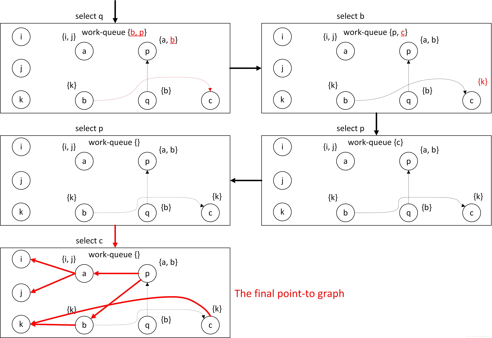
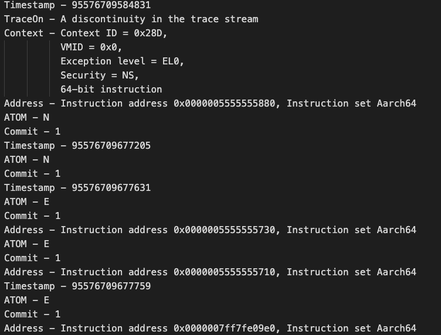
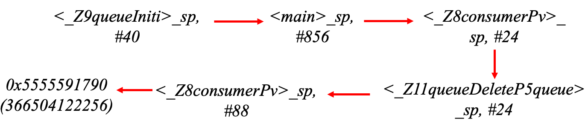
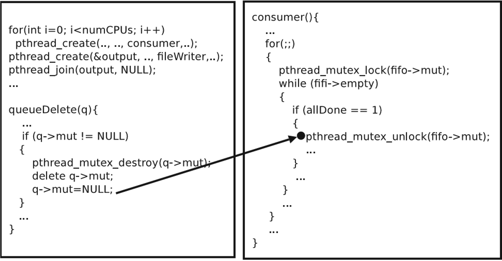

# Overview

---

## Architecture


# Online Part

---

## Trace

### Why we need more record in Online part?

- The limitation of REPT using PT trace and final memory dump
    - We found that this method is only applicable to the recovery of a small section of instructions before the crash
    - We cannot re-construct the register value which is changed by **syscall**
    - We cannot re-construct some function return value which is changed by ***xzr*** to ***0*** which is recorded in final memory dump.

### Why we need hook syscall
- We want to accurately recover the instruction data values further away from the crash point
- Find a way to log all **syscalls** in the record stage with low overhead

---

## How Linux handle syscall (arm64)? 

Linux has provided hook positions.

```c
void syscall_trace_exit(struct pt_regs *regs)
{
	audit_syscall_exit(regs);

	if (test_thread_flag(TIF_SYSCALL_TRACEPOINT))
		trace_sys_exit(regs, regs_return_value(regs));

	if (test_thread_flag(TIF_SYSCALL_TRACE))
		tracehook_report_syscall(regs, PTRACE_SYSCALL_EXIT);

	rseq_syscall(regs);
}
```

## How Linux handle syscall (arm64)? 
Besides, we also need hook in the enter of syscall, which also provided by Linux.

```c
int syscall_trace_enter(struct pt_regs *regs)
{
	// ... some pre-check ...

	if (test_thread_flag(TIF_SYSCALL_TRACEPOINT))
		trace_sys_enter(regs, regs->syscallno);

	// ... audit syscall entry

	return regs->syscallno;
}
```

## Sysdig: A Tool Could Capture Syscalls

- **sysdig** is a universal system visibility tool.
- sysdig leverages ***tracepoints*** and load drivers to capture kernel events.

---

## Deploy for syscall record

- We can install sysdig from source code and configure all dependencies manually. 
    - It is very difficult because the origin Juno OS is lack of **package manager** to install dependencies.
    - We customize a Linux Kernel and software stacks based on Yocto Project for Juno Board and successfully install sysdig.

- On the other hand, We also implement a tool to hook syscalls as sysdig does.

---

## Using Sysdig

A receipt for using sysdig to capture syscalls for a process named `zsh` and with pid `3981`

```bash
root@Juno:/home# sysdig proc.name=zsh and proc.pid=3981
3344 ... < read res=1 data=z 
3345 ... > rt_sigprocmask 
3346 ... < rt_sigprocmask 
3349 ... > fcntl fd=0(<f>/dev/pts/2) cmd=1(F_DUPFD) 
3350 ... < fcntl res=11(<f>/dev/pts/2) 
3351 ... > close fd=0(<f>/dev/pts/2) 
3352 ... < close res=0 
3353 ... > openat 
3357 ... < openat fd=0(<f>/dev/null) dirfd=-100(AT_FDCWD) ...
3362 ... > mmap addr=0 length=16384 prot=3(PROT_READ|PROT_WRITE) ...
3363 ... < mmap res=7F3CB2E39000 vm_size=53820 vm_rss=6456 vm_swap=0 
3364 ... > rt_sigprocmask 
3365 ... < rt_sigprocmask 
```

---

## Syscall record is still not enough

- The return result of some important C and C++ library fuction 
    - Such as **new** and **delete** fuction. Because the memory address is returned directly from the memory pool and not invoked by the ***mmap*** syscall.

- The return result of some trivial library function. 
    - Such as **strlen, strncpy, strncasecmp**

### We need record some Library fuction return values which are not in the syscall record

---

## Library Fuction hook

- The ***LD_PRELOAD*** trick is a useful technique to influence the linkage of shared libraries and the resolution of symbols (functions) at runtime.

- Hook ***New/Delete*** to get the heap address which is not recorded by sysdig.

### New function hook result

```bash
thread_id_1417 : ...new... : 0x55555916d0 with size=48
thread_id_1417 : ...new... : 0x5555591710 with size=48
thread_id_1417 : ...new... : 0x5555591750 with size=48
thread_id_1417 : ...new... : 0x5555591790 with size=72  
```

# Offline Part

---

## Control flow construction and Data flow inference

### Input: etm trace + coredump + record information

- etm trace + program binnary -> control flow
- control flow + coredump + record information -> data flow

### Output: Execution flow

- Including **order control flow** and **data flow** 

---


## Flow analysis

### Input: Execution Flow + coredump + other information

- ***Include-point-set analysis***.The flow-insensitive relation of memory variables is analyzed, we can obtain the memory pointer transfer relation graph.

- Analyse concurrency bug types. **Deadlock or Non Deadlock**

- Analyse object and target position.
    - Deadlock:lock obj location
    - Non Deadlock: corruption obj memory location, such as crash or parameter position which depend on the signal of failure (**segment fault, abort...**)

- Review relative instructions operands of these position.
    - For instruction positions without data value in data flow, refer to the location of these instructions as Location of Hardware Breakpoint/Watchpoint

---

## Flow analysis

### Output: 
- Memory pointer transfer relation graph
- Failure type
- Analysis point obj location
- Location of hardware breakpoint/watchpoint

---

## Include-point-set analysis
Why we need Include-point-set analysis

- The transfer relationship of the failure memory address is built so that all instruction locations related to the failed address can be found quickly

- Refer and modify from Lazy Diagnosis of In-Production Concurrency Bug (SOSP 17)

---

## Include-point-set analysis

**input: control_flow, analyse and construct constraints**


---

## Include-point-set analysis

**Example**


---

## Include-point-set analysis

**Anderson algorithm**


---

## Include-point-set analysis

**Get the points and edges**


---

## Include-point-set analysis

**Get the memory pointer transfer relation**


---

## Identical Re-execution for complete data flow construction

**1.Re-execution adjustment**

- According to the original control flow order to instrument binary to set delay, so that the Thread execution order of racing accesses during replay is consistent with the original control flow
    - The control flows of different threads in different CPU cores are combined into a control flow on a time line by the Timestamp of ETM

### In ETM trace online part, we have set ETM event to maximize the timestamp generation

- **Counter register** enable a trace unit to connect counter outputs to trace unit events, so that a counter at zero state can be used as a resource to activate an event

- We configure initial counter value and reload value of counter register to be **zero** so that make the timestamp register event generate all the time

---

## Identical Re-execution for complete data flow construction

Therefore, ETM timestamp accuracy is adequate in most of practical concurrency programe



---

## Identical Re-execution for complete data flow construction

**2.Adaptive Hardware breakpoint/watchpoint Approach**

### input: location of hardware breakpoint/watchpoint
- Set location of hardware breakpoint/watchpoint

- Re-execution and output coredump of corresponding location

- Using Control flow construction and Data flow inference

### output:
- Complete execution flow(control and data)

---

## Root cause of concurrency bug finding

### input: failure type, analysis point obj location, execution flow, memory pointer transfer relation graph

- according to failure type to use corresponding bug root cause analysis pattern
    - if Non Deadlock, including order violation + atomic violation:
        - analyse traget variable memory location(single or multi variables)
        - get corresponding instructions from execution flow according to transfer relation graph
        - get the data value and order from corresponding instructions
        - output corresponding instructions between threads with correct order

    - If Deadlock: output bug root cause: lock request instruction between threads with corresponding order

### output:

- The result of root cause of concurrency bug

# Sample

---

## Concurrency bug from pbzip2

### Crash position

```bash 
Timestamp - 357993179327945

<_Z8consumerPv>

3628: ldr  x0, [sp,#88]

data: (x0=0, sp,#88=0x5555591790,[sp,#88]=0 )

362c: ldr  x0, [x0,#48] 

data: x0,#48=48

3630:  bl  1a40 <pthread_mutex_unlock@plt>  

Timestamp - 357994169257407 
```

---

## Concurrency bug from pbzip2

### we can determine the key failure object position according to the signal SIGSEGV, Segmentation fault from coredump 

```bash 
3628: ldr  x0, [sp,#88]  -> <_Z8consumerPv>_sp,#88 
```

---

## Find the corresponding instructions with order from flow analysis



---

## Find Root cause

Find Root cause  according to corresponding control flow and data flow with order between main and consumer thread.


## Source code point of view


---

## Overhead evaluation

- Using UNIX Benchmarks

- Overhead 
    - Only enable the ETM is less than 0.1%.
    - Open the ETM and sysdig at the same time is 0.47%.


Due to the USB disk I/O limitation, we need to use ssd to test the ETM copy overhead further.


