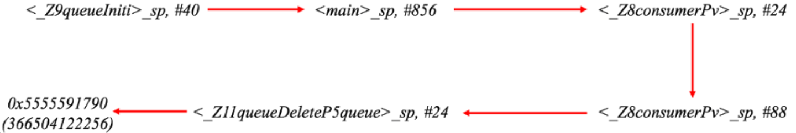
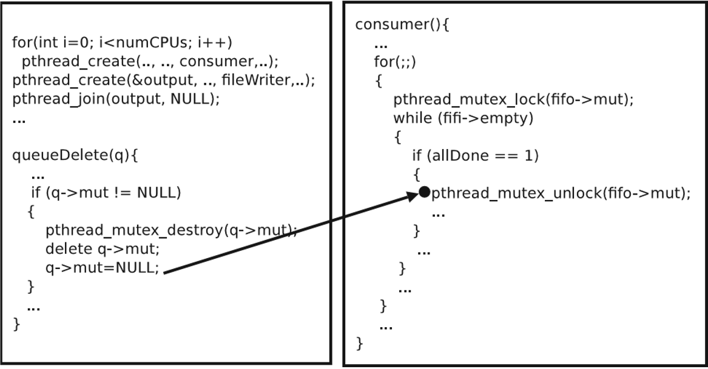

## Plan of Last Week

- According to Haonan's document to hook some libc to get more record to help data flow construction

- Find Root cause of concurrency bug from prototype

- Overhead evaluation

---


## Library Fuction hook

- Using ***LD_PRELOAD*** modify the linkage of shared libraries and the resolution of symbols at runtime.

- Hook ***New/Delete*** to get the heap address which is not recorded by sysdig.


### Hook result

```bash    
thread_id_1417 : ...new... : 0x5555591790 with size=72  
```


---

## Prototype of concurrency bug from pbzip2

### Crash position

```bash 
Timestamp - 357993179327945
<_Z8consumerPv>
3628: ldr  x0, [sp,#88]
(x0=0, sp,#88=0x5555591790,[sp,#88]=0 )

362c: ldr  x0, [x0,#48] x0,#48=48

3630:  bl  1a40 <pthread_mutex_unlock@plt>  
Timestamp - 357994169257407 
```

### we can determine the key failure object position according to the signal SIGSEGV, Segmentation fault from coredump 

```bash 
3628: ldr  x0, [sp,#88]  -> <_Z8consumerPv>_sp,#88 
```

---

## Find the corresponding instructions with order from flow analysis



---

## Find Root cause{.allowframebreaks}

Find Root cause  according to corresponding control flow and data flow with order between main and consumer thread.

```bash
Context - Context ID = 0x589
<_Z11queueDeleteP5queue>
3c00: ldr  x0, [sp, #24] 
(x0=0x5555591790,sp,#24=0x7FFFFFF6B8,[sp,#24]=0x5555591790)

3c10:  bl  1b40 <_ZdlPvm@plt> 
([0x5555591790]=0)

3c14: str  xzr, [sp, #24]
([sp, #24]=0)
```

```bash
Context - Context ID = 0x597
<_Z8consumerPv>:
3628: ldr  x0, [sp, #88]
(x0=0, sp,#88=0x5555591790, [sp,#88]=0 )

362c: ldr  x0, [x0, #48]
(x0,#48=48 )

3630: bl  1a40 <pthread_mutex_unlock@plt>  
```



---

## Overhead evaluation

- Using UNIX Benchmarks

- Overhead 
    - Only enable the ETM is less than 0.1%.
    - Open the ETM and sysdig at the same time is 0.47%.


Due to the USB disk I/O limitation, we need to use ssd to test the ETM copy overhead further.

---

## Plan

- POCs collection and Evaluation

- Switch to SSD and test the overhead
